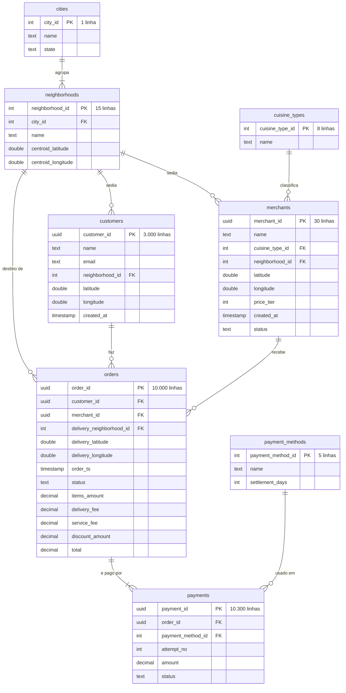

# ERD — fonte do degrau 1

> **Arquivo derivado.** A decisão mora nos ADRs `0005` a `0010`; este diagrama
> só a desenha. Se os dois divergirem, **o ADR vence** — e este arquivo é que
> precisa ser corrigido. Quando um ADR novo supersede um destes, o desenho é
> refeito junto, não depois.

As contagens de linha são de `S = 1`, o multiplicador do degrau 1
([ADR 0001](decisions/0001-parametros-dataset-degrau-1.md)).

## Como ler as cardinalidades

A notação é pé de galinha (*crow's foot*), e nela os dois símbolos do lado N
**não** são a mesma coisa. A diferença guarda decisão, não estética:

| Notação | Significado | Onde aparece, e por quê |
| -- | -- | -- |
| `\|\|--o{` | zero ou mais | `merchants → orders` e `customers → orders`: os 2 merchants e os 500 clientes **sem pedido** foram comprados de propósito pelo [ADR 0001](decisions/0001-parametros-dataset-degrau-1.md), para dar o caso de `LEFT JOIN` sem correspondência |
| `\|\|--\|{` | um ou mais | `orders → payments`: o [ADR 0008](decisions/0008-modelo-de-payments.md) fixou que **todo** pedido tem ao menos uma linha de pagamento, inclusive os 400 cancelados |

`cuisine_types → merchants` e `neighborhoods → merchants` aparecem como
zero-ou-mais por conservadorismo de notação, mas o
[ADR 0010](decisions/0010-regras-de-geracao-faltantes.md) garante cobertura:
cada culinária tem 3 ou 4 merchants e cada bairro tem exatamente 2. Grupo
categórico vazio no degrau 1 é bug, não caso de borda.

## O que o diagrama não mostra

Um ERD desenha tabela, coluna, chave e cardinalidade. Três coisas do modelo
ficam de fora, e nenhuma é acidente:

- **Unicidade e nulidade** — moram no
  [ADR 0009](decisions/0009-garantias-declaradas-da-fonte.md). Em resumo:
  rótulo único nas quatro tabelas de referência, `(order_id, attempt_no)`
  único em `payments`, e **nenhuma coluna anulável em nenhuma das oito
  tabelas**. `merchants.name`, `customers.name` e `customers.email`
  continuam **não** sendo únicos, de propósito.
- **O gabarito** — os 60 pares de cadastros duplicados vivem sob
  `ground_truth/`, fora do dataset
  ([ADR 0006](decisions/0006-modelo-de-customers.md)). Não é tabela: o
  pipeline nunca lê, o teste lê.
- **As regras de povoamento** — distribuições, derivação de chave por UUIDv5,
  ordem de geração e os casos de borda plantados estão nos ADRs `0005` a
  `0010`, e são o que transforma este esquema num dataset.

## A única cadeia de dois níveis

`cities → neighborhoods` é a única hierarquia de dois saltos do modelo. É ela
que dá à [KRA-30](https://linear.app/krasinski-projects/issue/KRA-30/primeira-transformacao-raw-para-curated)
uma escolha real entre achatar tudo numa estrela e preservar a hierarquia num
floco de neve — com as outras três tabelas de referência penduradas direto nas
entidades, a decisão seria apenas nominal.
